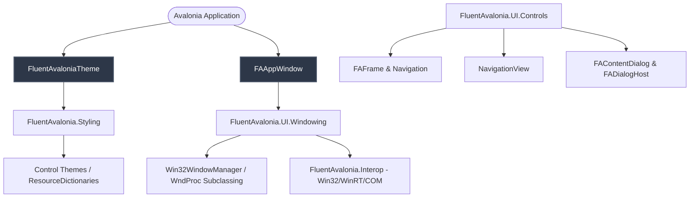
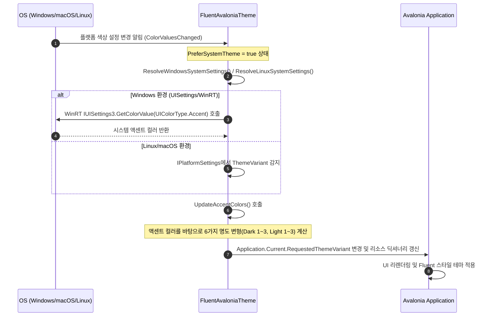
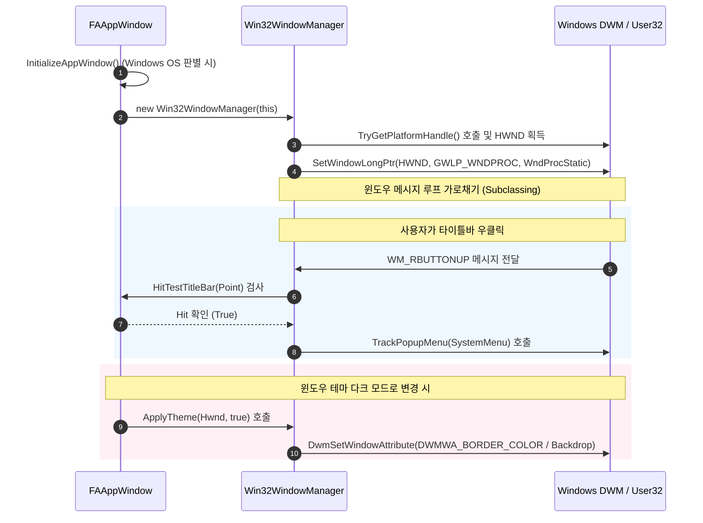
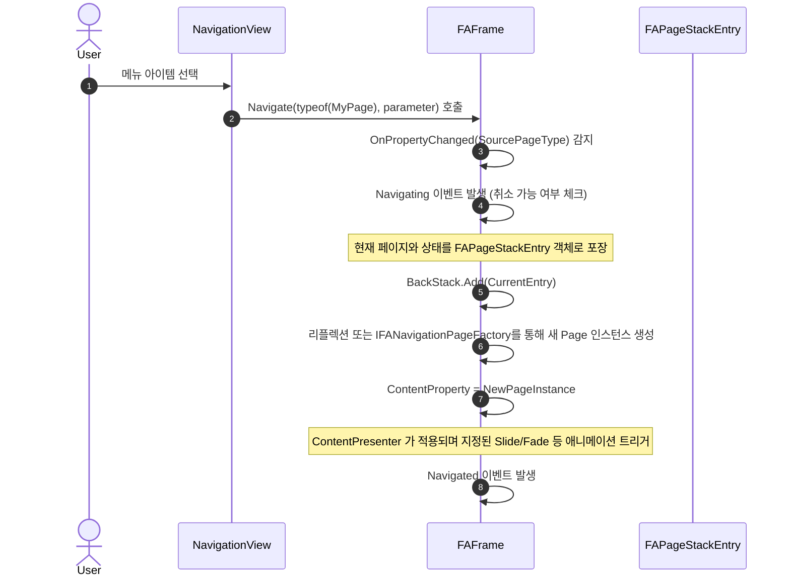
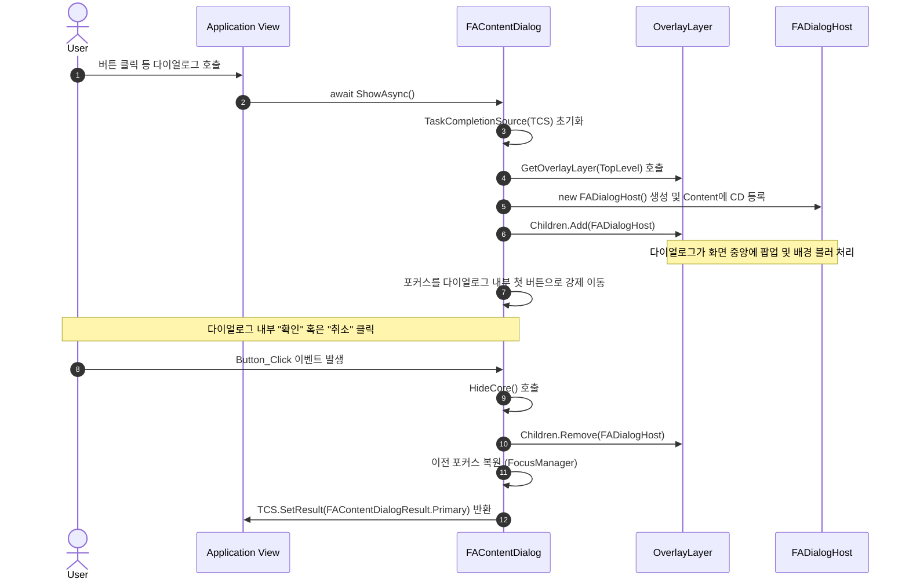

# FluentAvalonia 아키텍처 및 데이터 흐름 분석 보고서

본 보고서는 **FluentAvalonia** 라이브러리의 전체적인 코드 구조, 핵심 컴포넌트의 역할, 그리고 구성 요소 간의 데이터 흐름을 다이어그램과 소스코드 링크를 활용하여 상세히 설명합니다.

---

## 1. 전체 구조 개요 (Architectural Overview)

FluentAvalonia는 Microsoft의 WinUI 3 Fluent Design 스타일을 Avalonia UI 환경에 맞추어 이식한 크로스 플랫폼 라이브러리입니다. 프로젝트 소스 코드는 크게 스타일링, 윈도우 관리, 플랫폼 상호작용(Interop), 그리고 이식된 컨트롤군으로 구성되어 있습니다.

### 핵심 모듈 및 역할

1. **테마 관리 (`FluentAvalonia.Styling`)**
   - [FluentAvaloniaTheme](file:///d:/Sample_AvaloniUI/FluentAvalonia/FluentAvalonia/src/FluentAvalonia/Styling/Core/FluentAvaloniaTheme.axaml.cs): 전체 테마 및 리소스를 제어하는 중추 클래스입니다. OS 레벨의 다크/라이트 테마 변경 및 사용자의 액센트 컬러를 동적으로 수집하여 Avalonia 리소스에 바인딩합니다.
2. **윈도우 관리 (`FluentAvalonia.UI.Windowing`)**
   - [FAAppWindow](file:///d:/Sample_AvaloniUI/FluentAvalonia/FluentAvalonia/src/FluentAvalonia/UI/Windowing/AppWindow/FAAppWindow.cs): Windows 10/11의 modern titlebar, Mica/Acrylic 백드롭 효과, Snap Layout 등을 지원하기 위해 표준 `Window`를 확장한 커스텀 윈도우입니다. Non-Windows OS(macOS, Linux)에서는 기존 데코레이션 윈도우로 자연스럽게 Fallback됩니다.
3. **네이티브 상호작용 (`FluentAvalonia.Interop`)**
   - Windows Win32 API 및 WinRT COM 인터페이스([IUISettings](file:///d:/Sample_AvaloniUI/FluentAvalonia/FluentAvalonia/src/FluentAvalonia/Styling/Core/FluentAvaloniaTheme.windows.cs#L70), `ITaskbarList3` 등)를 정의하고 호출합니다.
4. **컴포넌트 컨트롤군 (`FluentAvalonia.UI.Controls`)**
   - WinUI의 `NavigationView`, `Frame`, `ContentDialog` 등의 기능을 Avalonia 컨트롤 트리 구조상에서 동작하도록 재구현한 집합체입니다.

---

## 2. 핵심 시나리오별 데이터 흐름 및 시퀀스

### A. 테마 및 액센트 컬러 동기화 흐름 (Theme & Accent Color Sync)

`FluentAvaloniaTheme`는 OS의 색상 모드 설정 변화를 구독하고, 사용자가 정의한 액센트 컬러 변형(Light 1~3, Dark 1~3)을 런타임에 동적으로 재구축합니다.

- **관련 코드**: [FluentAvaloniaTheme.windows.cs - TryLoadWindowsAccentColor()](file:///d:/Sample_AvaloniUI/FluentAvalonia/FluentAvalonia/src/FluentAvalonia/Styling/Core/FluentAvaloniaTheme.windows.cs#L107)

---

### B. 윈도우 서브클래싱 및 DWM 효과 적용 (FAAppWindow & Win32 Interop)

Windows 플랫폼에서 `FAAppWindow`는 네이티브 윈도우 프로시저(WndProc)를 가로채어 타이틀바 캡션 영역 우클릭 이벤트나 DWM 창 효과(Mica, Border Color)를 세밀하게 제어합니다.

- **관련 코드**: 
  - [Win32WindowManager.cs - WndProc()](file:///d:/Sample_AvaloniUI/FluentAvalonia/FluentAvalonia/src/FluentAvalonia/UI/Windowing/Win32/Win32WindowManager.cs#L37)
  - [Win32AppWindowFeatures.cs - SetWindowBorderColor()](file:///d:/Sample_AvaloniUI/FluentAvalonia/FluentAvalonia/src/FluentAvalonia/UI/Windowing/Win32/Win32AppWindowFeatures.cs#L46)

---

### C. 페이지 기반 내비게이션 (FAFrame & NavigationView Navigation Flow)

`FAFrame`은 UWP/WinUI의 내비게이션 스택 방식을 완벽히 재현하여 페이지 전환과 트랜지션 애니메이션을 관리합니다.

- **관련 코드**: [FAFrame.cs - Navigate()](file:///d:/Sample_AvaloniUI/FluentAvalonia/FluentAvalonia/src/FluentAvalonia/UI/Controls/Frame/FAFrame.cs#L57)

---

### D. 비동기 모달 오버레이 다이얼로그 (FAContentDialog & OverlayLayer)

`FAContentDialog`는 별도의 네이티브 자식 윈도우를 띄우지 않고, 현재 윈도우 최상위의 `OverlayLayer`에 `FADialogHost`를 추가하여 모달 레이아웃을 흉내 냅니다.

- **관련 코드**: [FAContentDialog.cs - ShowAsyncCoreForTopLevel()](file:///d:/Sample_AvaloniUI/FluentAvalonia/FluentAvalonia/src/FluentAvalonia/UI/Controls/ContentDialog/FAContentDialog.cs#L156)

---

## 3. 요약 및 핵심 파일 구조 매핑

| 기능 영역 | 주요 구현 클래스 | 소스코드 파일 경로 | 설명 |
| :--- | :--- | :--- | :--- |
| **Theme Management** | `FluentAvaloniaTheme` | [Core/FluentAvaloniaTheme.axaml.cs](file:///d:/Sample_AvaloniUI/FluentAvalonia/FluentAvalonia/src/FluentAvalonia/Styling/Core/FluentAvaloniaTheme.axaml.cs) | 다크/라이트 전환, 고대비 테마, 시스템 액센트 컬러 획득 및 변환을 처리합니다. |
| **Window Subclassing** | `Win32WindowManager` | [Win32/Win32WindowManager.cs](file:///d:/Sample_AvaloniUI/FluentAvalonia/FluentAvalonia/src/FluentAvalonia/UI/Windowing/Win32/Win32WindowManager.cs) | Windows OS 상에서 native HWND의 WndProc 이벤트를 가로채고 처리합니다. |
| **Mica/Border Custom** | `Win32AppWindowFeatures` | [Win32/Win32AppWindowFeatures.cs](file:///d:/Sample_AvaloniUI/FluentAvalonia/FluentAvalonia/src/FluentAvalonia/UI/Windowing/Win32/Win32AppWindowFeatures.cs) | DWM API를 이용해 Windows 11 윈도우 테두리 색상 및 작업표시줄 상태를 설정합니다. |
| **Page Navigation** | `FAFrame` | [Frame/FAFrame.cs](file:///d:/Sample_AvaloniUI/FluentAvalonia/FluentAvalonia/src/FluentAvalonia/UI/Controls/Frame/FAFrame.cs) | 내비게이션 스택과 화면 전환 애니메이션을 다룹니다. |
| **Modal Overlay** | `FAContentDialog` | [ContentDialog/FAContentDialog.cs](file:///d:/Sample_AvaloniUI/FluentAvalonia/FluentAvalonia/src/FluentAvalonia/UI/Controls/ContentDialog/FAContentDialog.cs) | 윈도우 오버레이 영역을 통해 모달 다이얼로그를 비동기식으로 구현합니다. |

FluentAvalonia는 크로스 플랫폼 호환성을 유지하기 위해 **OS 독립적인 UI 로직(Avalonia 고유 컨트롤 템플릿 및 레이아웃)**과 **OS 종속적인 기능(Win32/WinRT Interop)**을 명확하게 계층화하여 설계한 것이 가장 큰 특징입니다.
