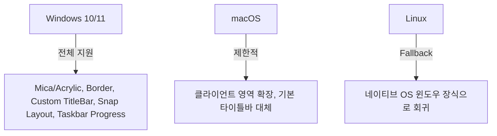

# FluentAvalonia 개발자 핵심 가이드 (실무 및 제약 사항)

FluentAvalonia를 사용하여 고품질 크로스 플랫폼 데스크톱 애플리케이션을 빌드할 때, 테마 외에 반드시 알아두어야 할 핵심 요소와 설계 제약 사항, 모범 사례를 정리합니다.

---

## 1. 아이콘 시스템 (IconElement)

FluentAvalonia는 WinUI 3와 동일한 선언적 아이콘 처리 시스템을 탑재하고 있습니다. 이를 이해해야 Fluent 디자인에 걸맞은 훌륭한 UI를 빌드할 수 있습니다.

```xml
<!-- 1. FontIcon: 폰트 내부의 유니코드를 이용한 아이콘 표시 -->
<ui:FontIcon Glyph="&#xE10F;" FontFamily="{StaticResource SymbolThemeFontFamily}" />

<!-- 2. SymbolIcon: 내장된 열거형(Symbol)을 사용하여 편리하게 호출 -->
<ui:SymbolIcon Symbol="Setting" />

<!-- 3. PathIcon: 벡터 경로(Path Geometry)를 이용한 커스텀 아이콘 -->
<ui:PathIcon Data="M 10,10 L 20,20" />
```

> [!IMPORTANT]
> **Windows 외 플랫폼(macOS/Linux/Mobile) 주의**  
> Windows 11에 탑재된 기본 기호 폰트인 `Segoe Fluent Icons`는 타 OS에 존재하지 않습니다. FluentAvalonia는 자체 번들된 [Symbols 폰트](file:///d:/Sample_AvaloniUI/FluentAvalonia/FluentAvalonia/src/FluentAvalonia/Styling/Core/FluentAvaloniaTheme.axaml#L8)(`SymbolThemeFontFamily`)를 탑재하여 크로스 플랫폼에서도 기호 아이콘이 정상적으로 보이도록 Fallback을 지원합니다. 아이콘 작성 시 `FontFamily="{StaticResource SymbolThemeFontFamily}"`를 지정하는 습관이 중요합니다.

---

## 2. 크로스 플랫폼 윈도우 관리 및 한계 (AppWindow & Fallback)

[FAAppWindow](file:///d:/Sample_AvaloniUI/FluentAvalonia/FluentAvalonia/src/FluentAvalonia/UI/Windowing/AppWindow/FAAppWindow.cs)는 강력하지만, OS마다 지원 범위가 다릅니다.



### 개발 시 체크 포인트
1. **Snap Layout(스냅 레이아웃)**: Windows 11에서는 최대화 버튼 위에 마우스를 올릴 때 스냅 레이아웃 팝업이 노출되나, 이는 Windows 전용 네이티브 API 연동의 결과물입니다. Linux/macOS에서는 동작하지 않습니다.
2. **Mica/Acrylic (미카 & 아크릴)**: 백드롭 효과는 OS의 창 컴포지터(Compositor)에 의존합니다. Windows 11 버전 및 하드웨어 가속 상태에 따라 효과가 자동으로 적용 혹은 해제되므로, 텍스트 가독성이 배경 투명도에 의존하지 않도록 항상 대비책 레이아웃 배경색을 설계해야 합니다.

---

## 3. 비동기 모달 대화상자 처리 (ContentDialog)

[FAContentDialog](file:///d:/Sample_AvaloniUI/FluentAvalonia/FluentAvalonia/src/FluentAvalonia/UI/Controls/ContentDialog/FAContentDialog.cs)는 비동기 흐름 제어(`async/await`)를 통해 윈도우 오버레이 레이어 위에서 열립니다.

### 올바른 대화상자 호출 패턴

```csharp
var dialog = new FAContentDialog
{
    Title = "저장 확인",
    Content = "변경 내용을 저장하시겠습니까?",
    PrimaryButtonText = "저장",
    SecondaryButtonText = "저장 안 함",
    CloseButtonText = "취소",
    DefaultButton = FAContentDialogButton.Primary
};

// 현재 활성화된 Window나 TopLevel을 매개변수로 전달해야 명확하게 위치를 지정할 수 있습니다.
FAContentDialogResult result = await dialog.ShowAsync();

if (result == FAContentDialogResult.Primary)
{
    // 저장 로직 실행
}
```

> [!WARNING]
> **대화상자 생명주기 및 충돌 방지**  
> `FAContentDialog`는 한 번에 단 하나만 띄울 수 있습니다. 이미 다이얼로그가 열려 있는 상태에서 또 다른 다이얼로그를 `ShowAsync()` 하려고 하면 오류가 발생하거나 예외가 던져지므로, 모달 관리를 위한 큐(Queue) 또는 사전 체크 로직이 필요합니다.

---

## 4. Avalonia v11 'ControlTheme' 패러다임의 이해

FluentAvalonia는 Avalonia UI v11 사양의 핵심 기능인 `ControlTheme`을 100% 활용합니다.

- **이전 스타일과의 차이**: 과거의 `<Style>` 시스템은 TargetType의 모든 컨트롤을 일괄 변경하여 전역 스타일 오염이 잦았습니다. 반면 `ControlTheme`은 컨트롤 인스턴스에 명시적인 테마 키를 할당할 수 있게 해줍니다.
- **스타일 재정의 방법**: FluentAvalonia가 제공하는 테마의 특정 속성만 수정하고 싶다면, `StaticResource`나 `DynamicResource` 키를 덮어쓰거나, 특정 테마를 기반으로 하는 파생 테마(`BasedOn`)를 상속 정의해야 합니다.

```xml
<!-- 특정 버튼에만 강조(Accent) 스타일을 수동 적용하는 예시 -->
<Button Content="확인" Theme="{StaticResource AccentButtonStyle}" />
```

---

## 5. 내비게이션 모델 설계 (Frame & Page)

[FAFrame](file:///d:/Sample_AvaloniUI/FluentAvalonia/FluentAvalonia/src/FluentAvalonia/UI/Controls/Frame/FAFrame.cs)을 통한 화면 전환 시, 메모리 누수와 객체 생명주기를 주의해야 합니다.

- **기본 캐싱 모드**: 페이지 이동 시 이전 페이지의 인스턴스가 파괴되는 것이 기본 동작입니다. 그러나 뒤로 가기 성능 향상을 위해 페이지 캐싱이 필요하다면 `NavigationCacheMode`를 설정할 수 있습니다.
- **파라미터 전달**: `Navigate(typeof(MyPage), customData)` 호출 시 목적지 페이지 클래스의 `OnNavigatedTo(NavigationEventArgs e)` 오버라이드 메서드를 통해 매개변수를 안전하게 받아와 뷰 모델의 상태를 갱신해야 합니다.
