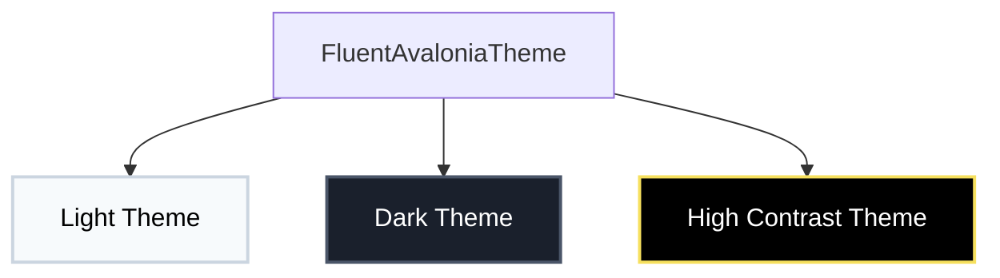
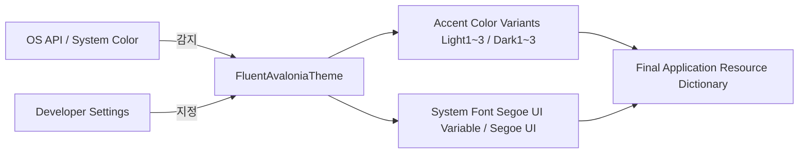

# FluentAvalonia 테마 제공 사양 및 상세 가이드

FluentAvalonia는 기본적으로 **Windows 11의 WinUI 3 (Fluent v2) 디자인 시스템**을 고스란히 재현합니다. 본 문서에서는 FluentAvalonia가 제공하는 테마의 종류, 특성, 그리고 다이내믹하게 연동되는 세부 옵션들을 상세하게 설명합니다.

---

## 1. 제공하는 핵심 테마 변이 (Theme Variants)

FluentAvalonia는 크게 3가지의 주요 테마 변이(`ThemeVariant`)를 기본 내장하고 있습니다.



### 1) 라이트 테마 (Light Theme)
- **개요**: 전통적인 밝은 화면 구성입니다.
- **특징**:
  - 부드러운 오프화이트 및 밝은 회색 계열의 배경색을 베이스로 사용합니다.
  - 가독성을 위해 어두운 차콜(Dark Charcoal) 톤의 전경 텍스트 색상을 제공합니다.
  - 컨트롤의 경계선이나 섀도우가 은은하게 도드라져 깔끔하고 전문적인 느낌을 줍니다.

### 2) 다크 테마 (Dark Theme)
- **개요**: 눈의 피로를 덜어주고 세련된 룩을 구현하기 위해 최적화된 어두운 화면 구성입니다.
- **특징**:
  - 완전한 검은색이 아닌 미세한 회색 톤(`약 #1C1C1C~#202020`)을 배경으로 채택하여 지나친 대비로 인한 피로감을 억제합니다.
  - 텍스트는 순수한 흰색이 아닌 약간 투명도가 적용되거나 미세한 미색이 감도는 색상을 매핑하여 눈부심을 차단합니다.
  - **Mica 및 Acrylic 백드롭(Backdrop) 효과**와 가장 궁합이 좋은 테마로, 배경 레이어의 반투명 텍스트와 블러 효과가 극대화됩니다.

### 3) 고대비 테마 (High Contrast Theme)
- **개요**: 윈도우의 접근성 옵션인 '고대비 테마'를 모사하거나 연동하는 특수 테마입니다.
- **특징**:
  - 저시력자나 가독성이 극도로 중요한 사용자 환경을 위해 디자인되었습니다.
  - 불필요한 입체 효과, 그라데이션, 섀도우를 전면 제거하고 흑백 및 단색(노란색, 청록색 등 고대비 전용 강조색) 위주의 극단적인 선 위주 레이아웃을 제공합니다.
  - Windows의 `UISettings` API를 통해 시스템에 설정된 고대비 색상을 런타임에 직접 수집하여 리소스 딕셔너리에 덮어씌웁니다.

---

## 2. 동적 테마 연동 및 커스터마이징 기능

FluentAvalonia는 단순한 고정 스타일 시트가 아니라, OS 및 사용자 설정에 반응하여 테마를 실시간으로 조립 및 적용하는 강력한 엔진을 가지고 있습니다.



### 1) 시스템 테마 자동 동기화 (`PreferSystemTheme`)
- `PreferSystemTheme = true`로 설정하면, 사용자가 OS 제어판에서 다크 모드/라이트 모드/고대비를 바꿀 때마다 앱이 이벤트를 구독하여 `RequestedThemeVariant`를 자동으로 동기화합니다.
- Windows는 물론 macOS, Linux(Gnome, KDE, Xfce 등 데스크톱 환경별 맞춤 감지 로직 탑재) 환경까지 유연하게 대응합니다.

### 2) 사용자 액센트 컬러 동기화 (`PreferUserAccentColor`)
- Windows, MacOS, Linux OS 등 시스템 제어판에서 사용자가 지정한 브랜드 테마 색상(Accent Color)을 앱 내부에 즉시 이식합니다.
- 예컨대 사용자가 윈도우 테마색을 "초록색"으로 지정하면, 앱의 버튼 포커스선, 체크박스 체크색, 텍스트 커서 등이 연동되어 초록색 톤으로 변합니다.

### 3) 사용자 정의 액센트 컬러 (`CustomAccentColor`)
- 개발자가 특정 브랜드 컬러를 고정하여 앱의 포인트 컬러로 쓰고 싶을 때 사용합니다.
- 단 하나의 중심 색(예: `CustomAccentColor = Color.FromRgb(30, 144, 255)`)만 지정해주면, 테마 내부에서 수식을 계산해 **총 6개의 변형 컬러**를 자동 산출하여 테마 리소스로 등록합니다:
  - `SystemAccentColorLight1` / `Light2` / `Light3` (라이트 테마용 명도 조절 강조색)
  - `SystemAccentColorDark1` / `Dark2` / `Dark3` (다크 테마용 명도 조절 강조색)

### 4) 시스템 폰트 자동 탐지 (`UseSystemFontOnWindows`)
- Windows OS에서 실행 시 화면의 디테일을 높이기 위해 네이티브 시스템 폰트를 동적으로 매핑합니다.
  - **Windows 11**: 세련된 레이아웃 및 굵기 표현을 보장하는 `Segoe UI Variable` 폰트 적용
  - **Windows 10**: 대중적인 `Segoe UI` 적용
  - **기타 OS (macOS, Linux)**: 자연스러운 Fallback 시스템 기본 폰트 패밀리 적용

---

## 3. 요약 및 설정 권장 예제

보통 FluentAvalonia를 시작할 때 `App.axaml`에 아래와 같이 구성하여 OS 테마와 사용자 설정을 그대로 따라가게 하거나, 고유 브랜드 컬러를 얹는 패턴을 씁니다.

### 예제: App.axaml 내 FluentAvaloniaTheme 구성

```xml
<Application xmlns="https://github.com/avaloniaui"
             xmlns:x="http://schemas.microsoft.com/winfx/2006/xaml"
             xmlns:sty="using:FluentAvalonia.Styling"
             x:Class="MyApp.App">
    <Application.Styles>
        <!-- FluentAvaloniaTheme 정의 -->
        <sty:FluentAvaloniaTheme PreferSystemTheme="True" 
                                 PreferUserAccentColor="True"
                                 UseSystemFontOnWindows="True" />
    </Application.Styles>
</Application>
```

- **직접 액센트 지정 시**: `PreferUserAccentColor="False"`로 둔 뒤, 비하인드 코드에서 `CustomAccentColor`에 원하는 색상을 입력하여 브랜드 고유 아이덴티티를 확립할 수 있습니다.
